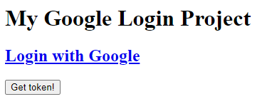

# Django SSO Investigation

* Install django-rest-auth and django-allauth
    * `pip install django-rest-auth django-allauth`
* Run django server (and migrate if needed)
    * `python manage.py migrate`
    * `python manage.py runserver localhost:8880`
* Navigate to `localhost:8880` on browser and login to google
    * 
    * 
    * 
* You'll be redirected back to the homepage
    * 
* Click get token
    * 
   